# docker-c2ldapsync

## Installation and Setup
1. If you havent done so already, install the <a href="https://kb.synology.com/en-us/DSM/help/ContainerManager/docker_desc?version=7">Container Manager</a> package and make sure it is running. If you are running a DSM version earlier than 7.2 then the package is called Docker.

2. Create a folder in your Synology NAS to hold the files necessary to run the docker container. For this example, we will create the folder c2ldapsync within the docker folder as shown in screenshot below.

  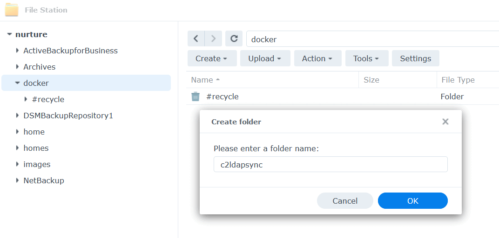

&nbsp;

3. Login to your C2 Identity account to download the necessary files and commands using sub steps below:
<table width="100%" border="0" align="right">
  <tr>
    <td width="50%" align="left">3a. Tap on "Directory Integration" and select "Integrate Synology LDAP" by tapping on associated button</td>
    <td width="50%" align="center">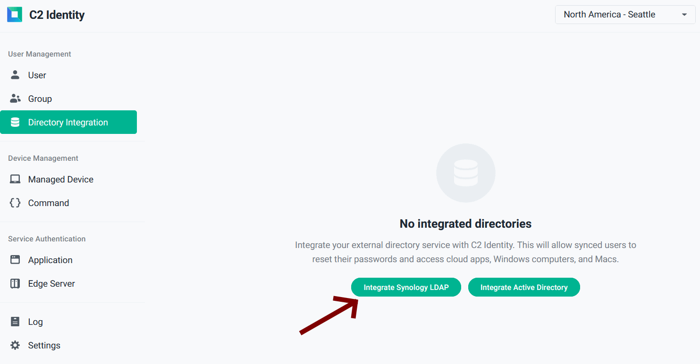</td>
  </tr>
  <tr>
    <td width="50%" align="left">3b. Select "Run on Linux" as the platform choice.</td>
    <td width="50%" align="center">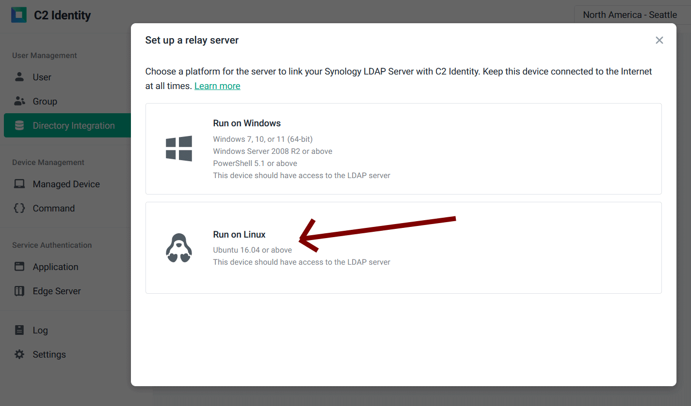</td>
  </tr>
  <tr>
    <td width="50%" align="left">3c. Fill in your LDAP server details. Note: Make sure you fill in the port field manually based on the suggested number displayed from the Protocol choice (389 or 636), otherwise the docker container will fail to work.</td>
    <td width="50%" align="center">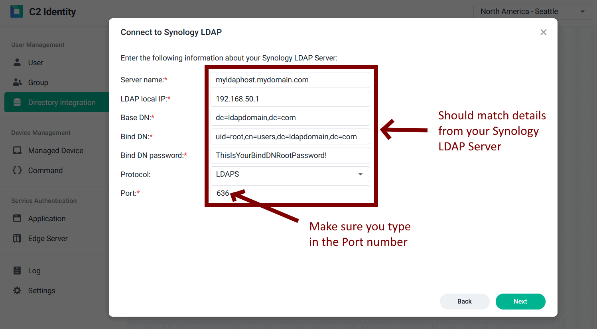</td>
  </tr>
  <tr>
    <td width="50%" align="left">3d. Download the C2 Identity LDAP sync software and copy the commands into a file called install.sh</td>
    <td width="50%" align="center">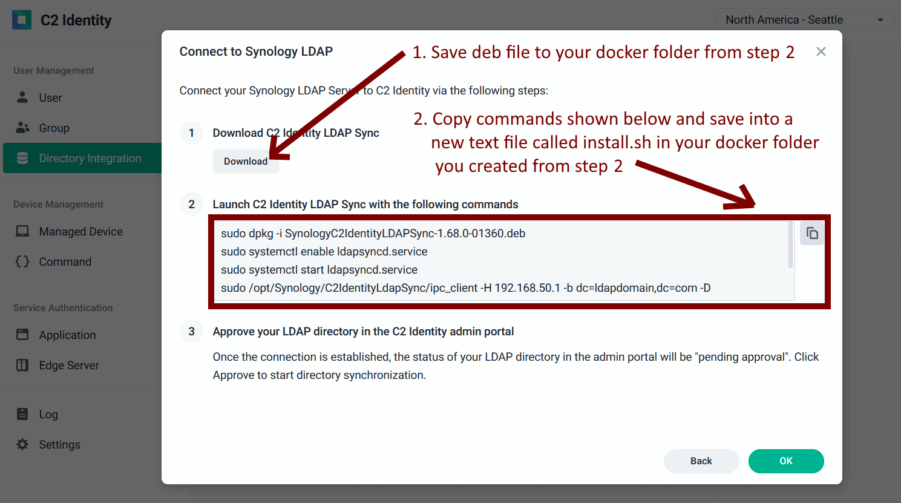</td>
  </tr>
</table>

&nbsp;

4. Upload the downloaded software (.deb) file and the install.sh file containing commands from step 3d you created to the docker folder (e.g. "c2ldapsync") from Step 2.

  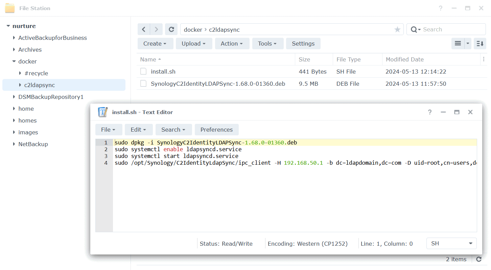

&nbsp;

5. Open the Container Manager Application on your NAS and download the image bigmudcake/docker-c2ldapsync from the Docker Hub Registry as shown in the screenshot below. You can use the search word "bigmudcake" to filter the list and find the correct image.

  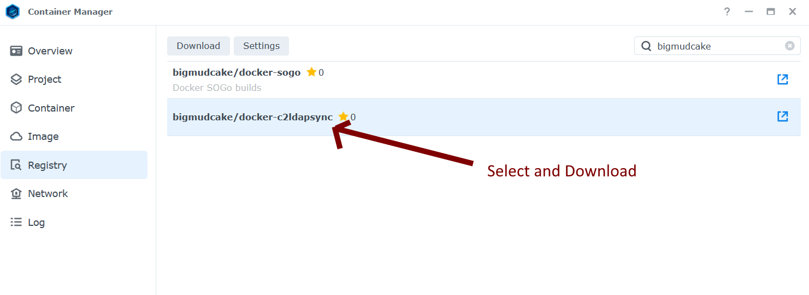

&nbsp;

6. Create and run the docker container on your NAS using sub steps below. 
<table width="100%" border="0" align="right">
  <tr>
    <td width="50%" align="left">6a. In Container Manager tap on create within the "Container" tab and fill in details as shown in screenshot. Make sure image "bigmudcake/docker-c2ldapsync:latest" is selected.</td>
    <td width="50%" align="center">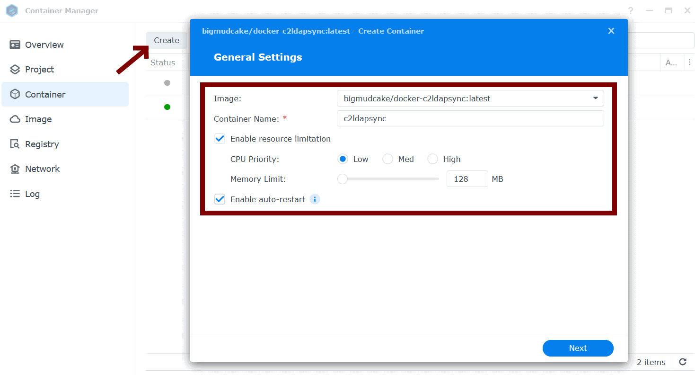</td>
  </tr>
  <tr>
    <td width="50%" align="left">6b. In the "Volume Settings" section tap "Add Folder" and select the docker folder you created from Step 2 (e.g. "c2ldapsync").</td>
    <td width="50%" align="center">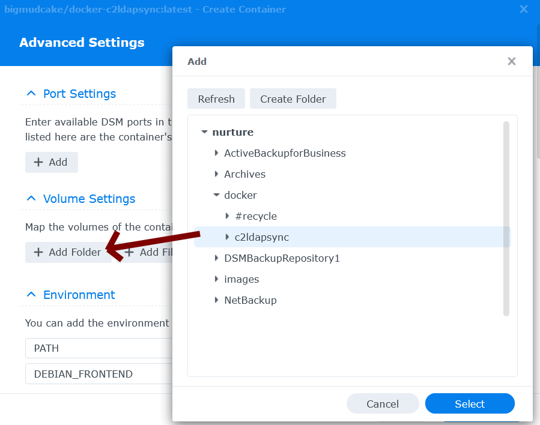</td>
  </tr>
  <tr>
    <td width="50%" align="left">6c. Type in "/install" (case sensitive) within the text field to the right of the docker folder you selected from step 6b (e.g. "/docker/c2ldapsync").</td>
    <td width="50%" align="center">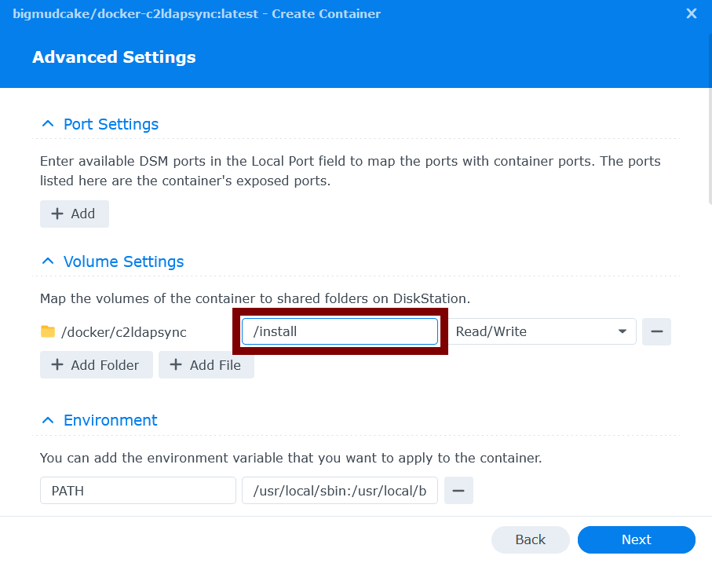</td>
  </tr>
  <tr>
    <td width="50%" align="left">6d. Check final summary screen to make sure all is correct and tap Done. Make sure "Run this container after wizzard is finished" is ticked.</td>
    <td width="50%" align="center">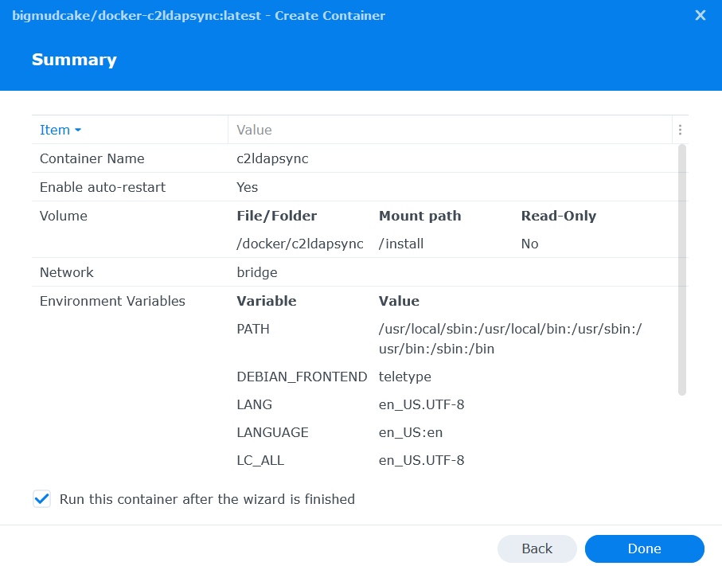</td>
  </tr>
</table>

&nbsp;

7. If your docker container is still running after a few minutes then you should see the LDAP approval screen appear in your C2 Identity account within the "Directory Integration" section similar to screenshot below.  Approve and your LDAP users and groups will now get synced.

  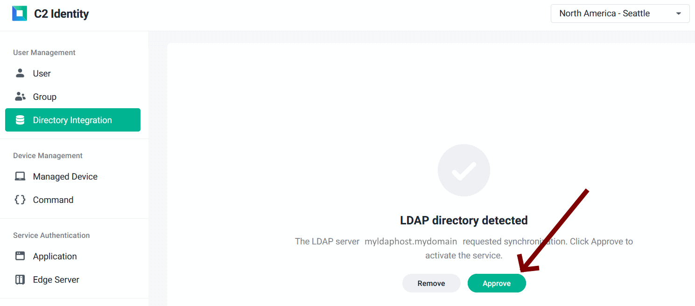

&nbsp;

## Troubleshooting and Debugging
Wait at least 1 minute to see if your docker container shuts down unexpectedly. If it does, than that means something went wrong. Run through the installation instructions again pay particular attention to the LDAP information you provide, plus the commands you copied from your C2 Identity account during setup.

You can also view the docker logs to get a detailed run through of the docker container starting up. To do this, tap on the "Details" button on the selected container and you will see a screen similar to the one below. 

  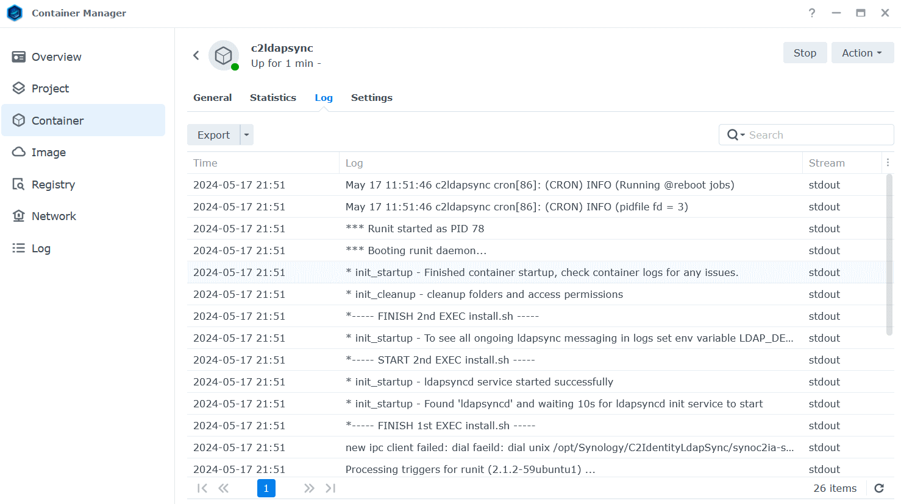

&nbsp;

If nothing is obvious in the logs then stop the container and change the environment variable LDAP_DEBUG from 0 to 1 in the Settings screen as shown below. Then restart the container and have a look at the logs again for any further messages that might be of help.

  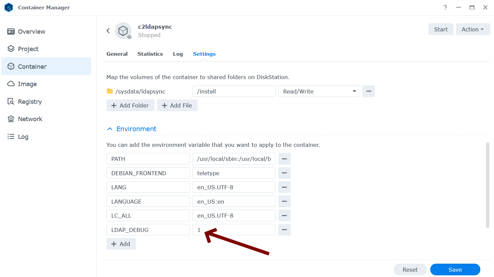

&nbsp;

